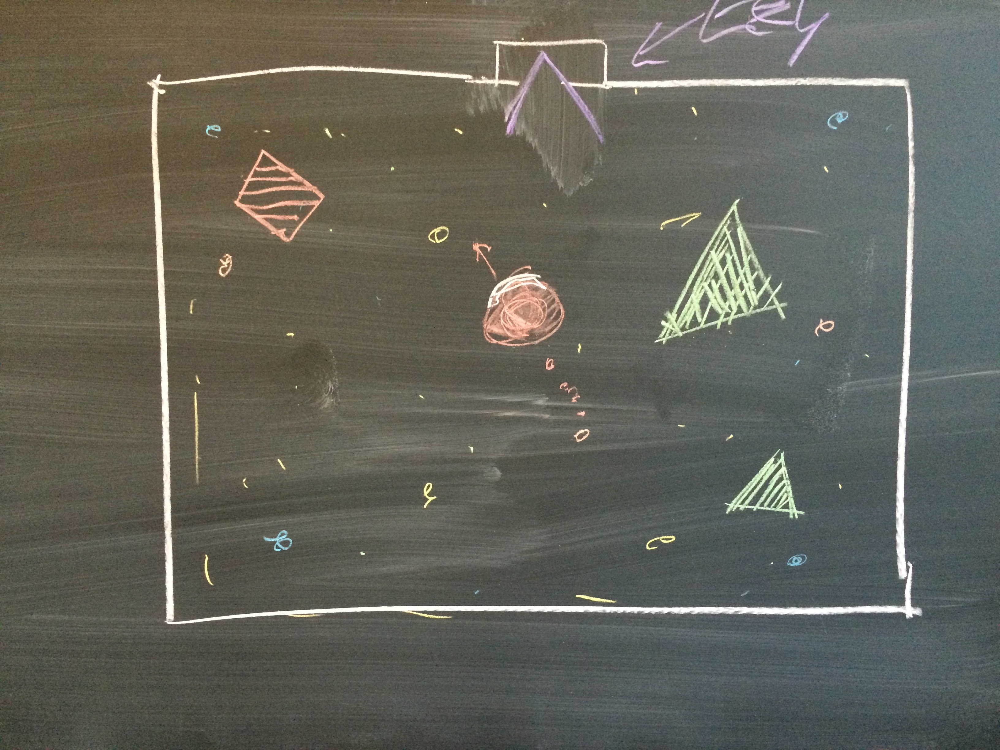

### Installation (Desktop)
TBA

### Testing Strategy
Using the structure of Model-View-Controller we plan to do basic testing in a non-graphic View using JUnit 4.0. Other than that we'll create a test level for users to run through the mechanics and feel of the game.

# nameless_project
XX is a beautiful game made in Oracle's Java, with The Internet™ features by the use a server written in Golang.

XX is 2D topdown game, where you are a blob in an unknown space. You are to survive by propelling yourself forward, and steering out of danger's way. There are unfamiliar shapes which are hostile to you. They move in predictable patterns in the space. You're boxed in, use your boosted mode to knock out the hostiles.

