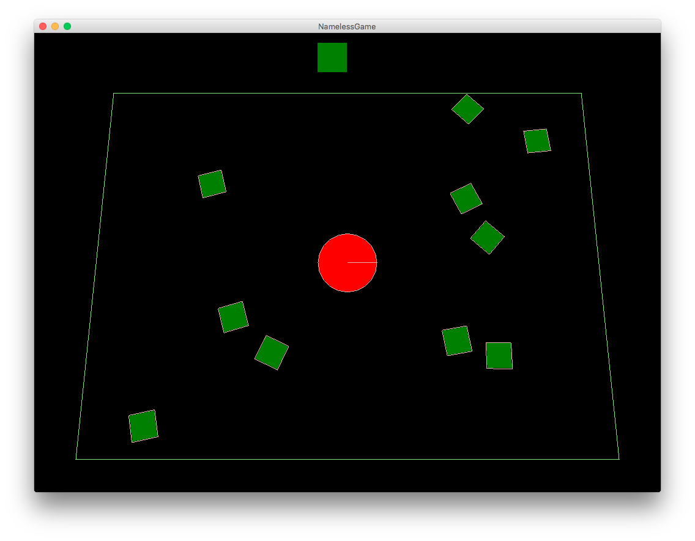

## nameless_project
The goal in NamelessGame is to survive as long as possible and acquire as many points as possible. You lose if an enemy touches you and they are not the target type, you get a point if they are the target type.

The current target type is shown at the top of the screen and is chosen at random. Each time you get a point it will refresh.

You move around the screen using Up/Left/Right or W/A/D keys. Holding down spacebar causes the player to go faster.

### Installation (Desktop)
#### Run Jar
Locate the runnable Jar which is included in the project. Run it in the command line with `java -jar path-to-jar-file` or run it with your operating system's GUI.

#### Install from source
To install from source, import project to Eclipse using Gradle. [See this article for more information](https://github.com/libgdx/libgdx/wiki/Gradle-and-Eclipse). Once installed, right click on the desktop project, select export, and finally export as runnable Jar. [See this article for more information](https://github.com/libgdx/libgdx/wiki/Deploying-your-application). 

Once the Jar has been created, you can run it.

### First idea

### Game as of 2016-05-20

### Game as of 2016-05-08

